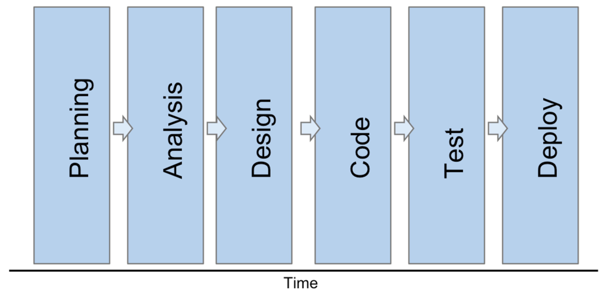
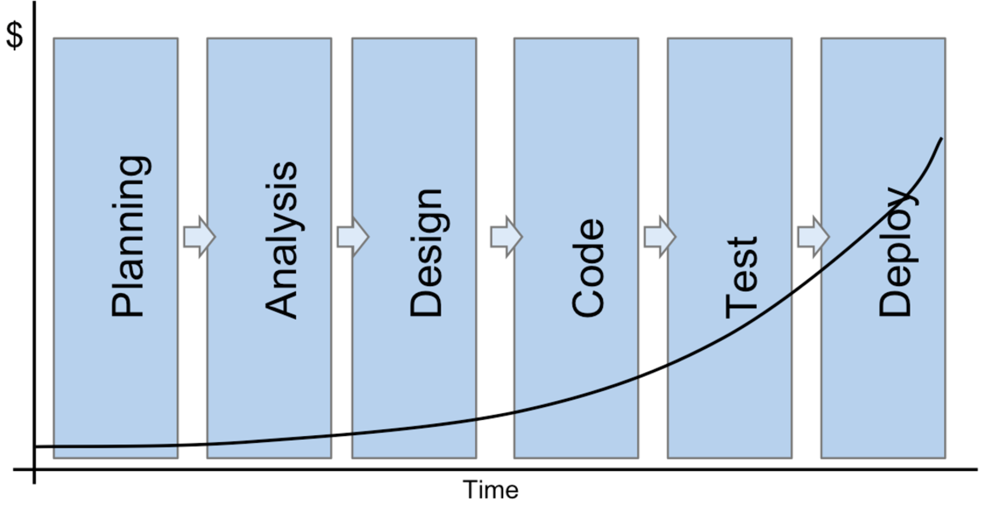
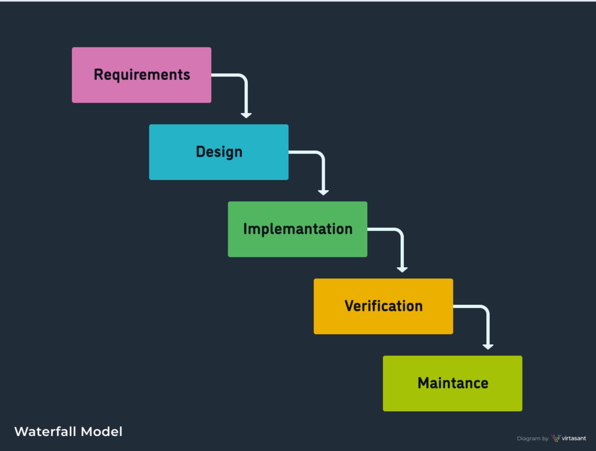
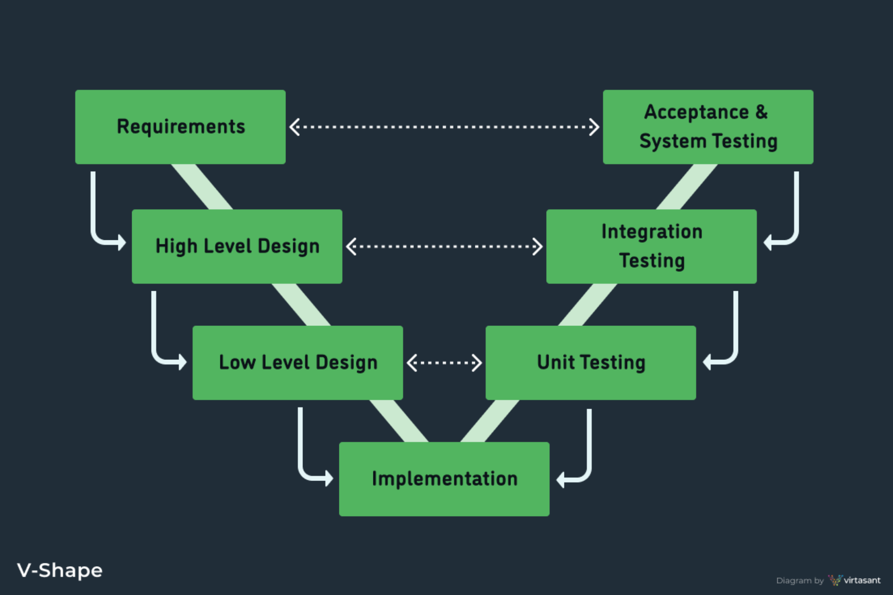
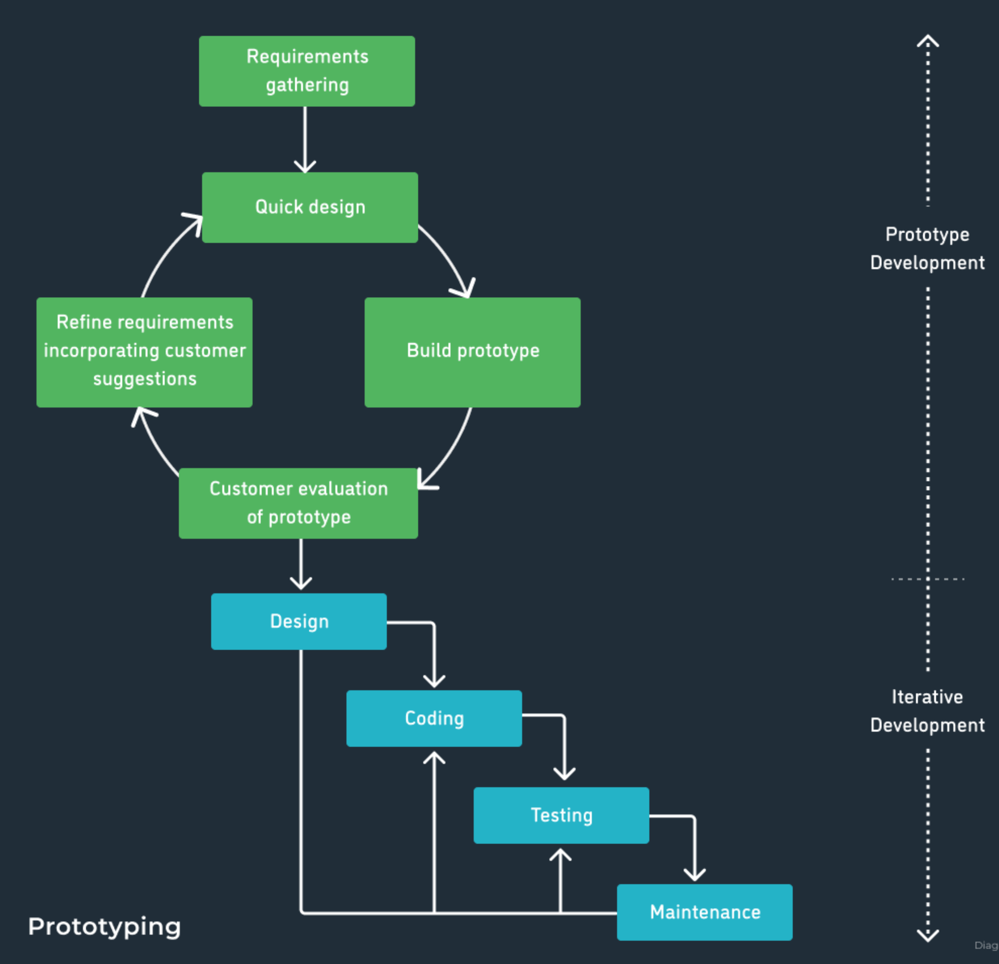
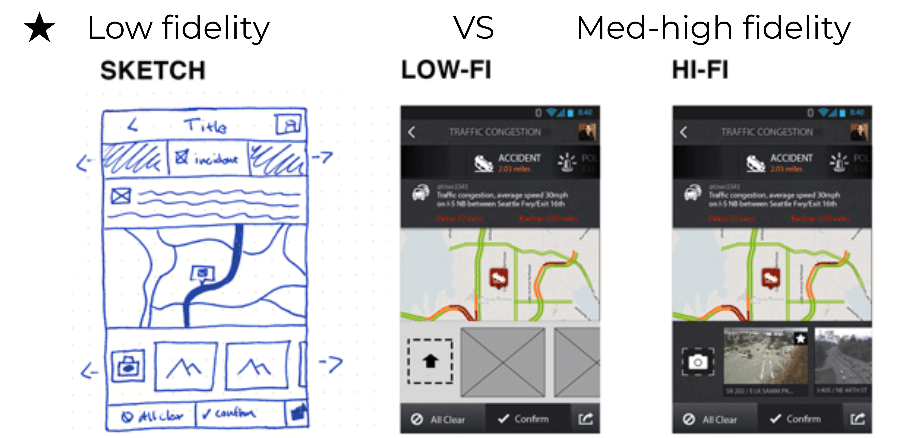
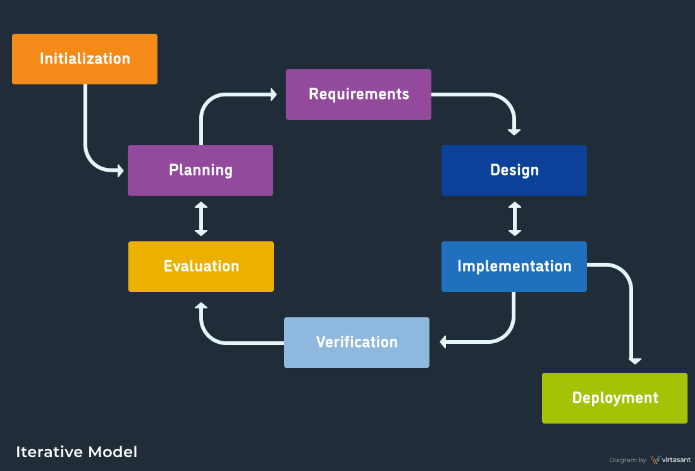

# SDLC
## Phases
* Planning – resource allocation and management
* Requirements Specification – identifies necessary  features
* Design – architecture, modules, interfaces
* Development – implementation
* Testing – validation of correctness
* Documentation – describes product
* Maintenance – ongoing error correction
* Evolution – ongoing requirements changes

* Goal of Phases
    * Clarify steps to be performed
    * Produce tangible work products
    * Enable others to review work products
    * Specify next steps

## Stages of Software Development

* Example: 
    * Relative cost of fixing errors at various stages  are:
        * Specification (3)
        * Design (5)
        * Implementation (50)
        * Maintenance – after deploy (300)
    * If cost to find and fix an error in design is $100, what are the costs for other stages?

## SDLC (Software Development Life Cycle)
### SDLC Methodologies
#### Waterfall 
* Linear-sequential life cycle model
* Phases are dependent on each other
* Teams are large
* Can take several months or even years to complete

* Requirement
    * Well understood and  stable requirements upfront
* Advantage 
    * Easy to plan and staff
* Disadvantage
    * Iterations are costly $$
    * Lack of feedback from customers

#### V-Shape 
* Variant of the Waterfall
    * Validation and Verification
* Requirement
    * Well understood and  stable requirements upfront
    * Testing is done in parallel
* Good for high reliability systems

#### Prototyping 
* Low fidelity prototypes
* Easy to build
* Readily modifiable/extensible, 
* Partially specified working model of overall system
* Early feedback 
* Good model for new systems

#### Iterative 
* Emphasized iterative and incremental
* Major requirements are known from the beginning
* Prioritizes important functionality

#### Spiral
#### Agile
* Scrum, Kanban, Extreme Programming (XP)
