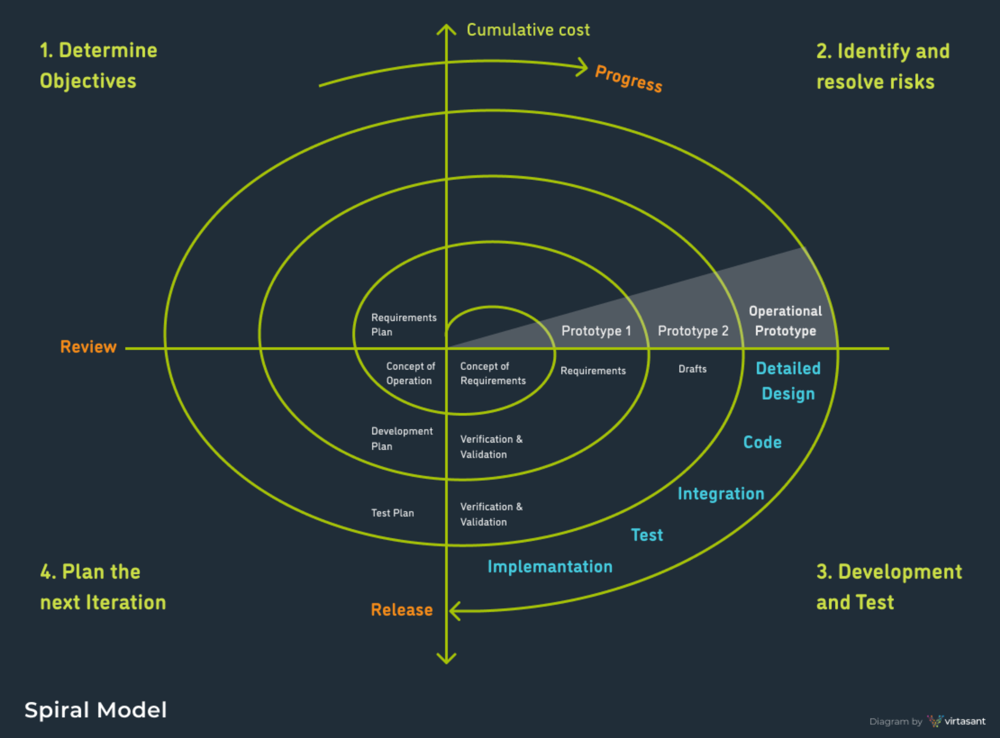
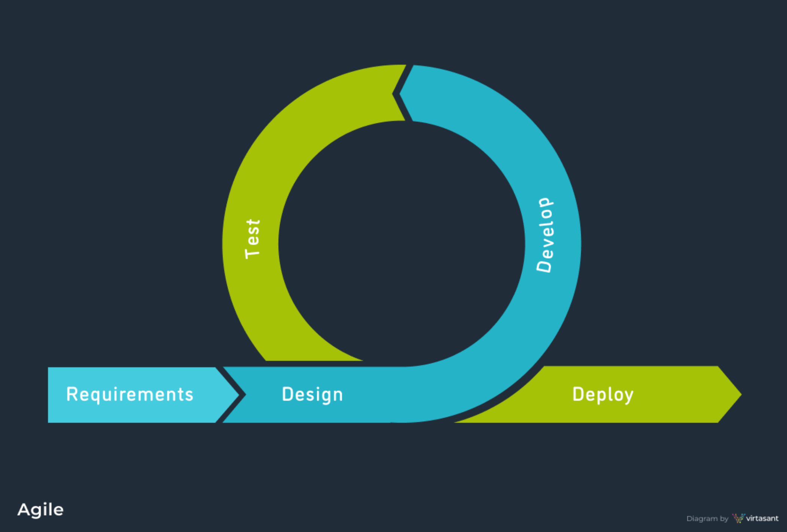
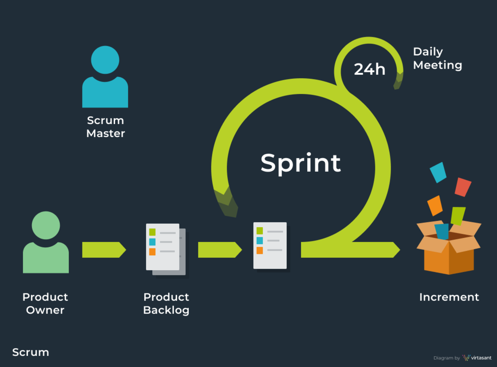
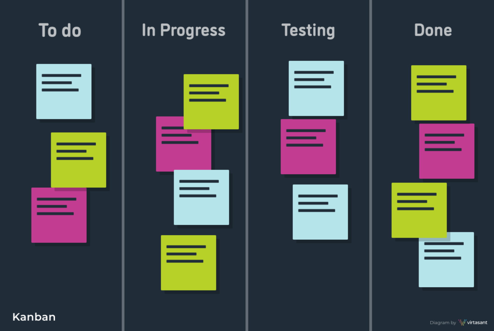
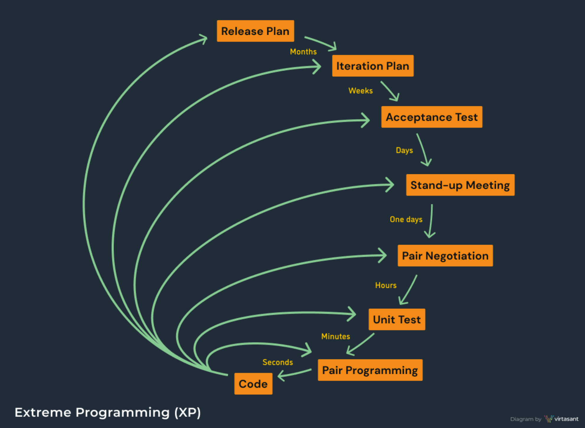

# SDLC
## Phases
* Planning – resource allocation and management
* Requirements Specification – identifies necessary  features
* Design – architecture, modules, interfaces
* Development – implementation
* Testing – validation of correctness
* Documentation – describes product
* Maintenance – ongoing error correction
* Evolution – ongoing requirements changes

* Goal of Phases
    * Clarify steps to be performed
    * Produce tangible work products
    * Enable others to review work products
    * Specify next steps

## Stages of Software Development

* Example: 
    * Relative cost of fixing errors at various stages  are:
        * Specification (3)
        * Design (5)
        * Implementation (50)
        * Maintenance – after deploy (300)
    * If cost to find and fix an error in design is $100, what are the costs for other stages?

## SDLC (Software Development Life Cycle)
### SDLC Methodologies
#### Waterfall 

* Linear-sequential life cycle model
* Phases are dependent on each other
* Teams are large
* Can take several months or even years to complete

* Requirement
    * Well understood and  stable requirements upfront
* Advantage 
    * Easy to plan and staff
* Disadvantage
    * Iterations are costly $$
    * Lack of feedback from customers

#### V-Shape 
* Variant of the Waterfall
    * Validation and Verification
* Requirement
    * Well understood and  stable requirements upfront
    * Testing is done in parallel
* Good for high reliability systems

#### Prototyping 
* Low fidelity prototypes
* Easy to build
* Readily modifiable/extensible, 
* Partially specified working model of overall system
* Early feedback 
* Good model for new systems

#### Iterative 
* Emphasized iterative and incremental
* Major requirements are known from the beginning
* Prioritizes important functionality

#### Spiral 
* 4 "Quadrant"
    * Objectives
    * Risks
    * Development
    * Plan next iteration
* Similar to Waterfall
    * Risk analysis

* Spiral - Quadrant #1
    * Objectives: functionality, performance, hardware/software interface, critical success factors (etc.)
    * Alternatives: build, reuse, buy, sub-contract, etc.
    * Constraints: cost, schedule, interface, etc.
* Spiral - Quadrant #2
    * Study alternatives relative to objectives and constraints
    * Identify risks (lack of experience, new technology, tight schedules, poor process, etc.
    * Resolve risks (evaluate if money could be lost by continuing system development
* Spiral - Quadrant #3
    * Create a design
    * Review design
    * Develop code
    * Inspect code
    * Test product
* Spiral - Quadrant #4
    * Develop project plan
        * Schedule 
        * Cost
        * Requirements
        * Test plan

#### Agile 
* Most popular SDLC
* Flexible 
* Based on agile roles
* Multiple "cycles"
* Continues collaboration
* Regular feedback and iterations 

* Agile Manifesto
    * Individuals and interactions over processes and tools
    * Working software over comprehensive documentation
    * Customer collaboration over contract negotiation
    * Responding to change over following a plan
* Agile Roles
    * Product Owner
        * Responsible for project requirements
    * Scrum Master
        * Responsible for project schedule / cost/ completion
    * Team Member
        * Development, Q/A, Client services etc.
* Popular Agile Frameworks
    * Scrum 
        * Most popular Agile framework
        * Cycles called "Sprints"
            * Sprint Planning
            * Daily Standups 
            * Retrospective Meetings
        * Scrum master 
            * Manage process / productivity
    * Kanban 
        * "Signboard" in Japanese
        * Agile scheduling system
            * Uses "cards" & "lanes" to track
        * Examples
            * Github Project
            * Trello
            * Jira
    * Extreme Programming XP 
        * Based on project flexibility 
        * Pair Programming 
        * Comprehensive testing 
        * Continue communication between team
    * Feature Driven Development (FDD)
    * …many more!

